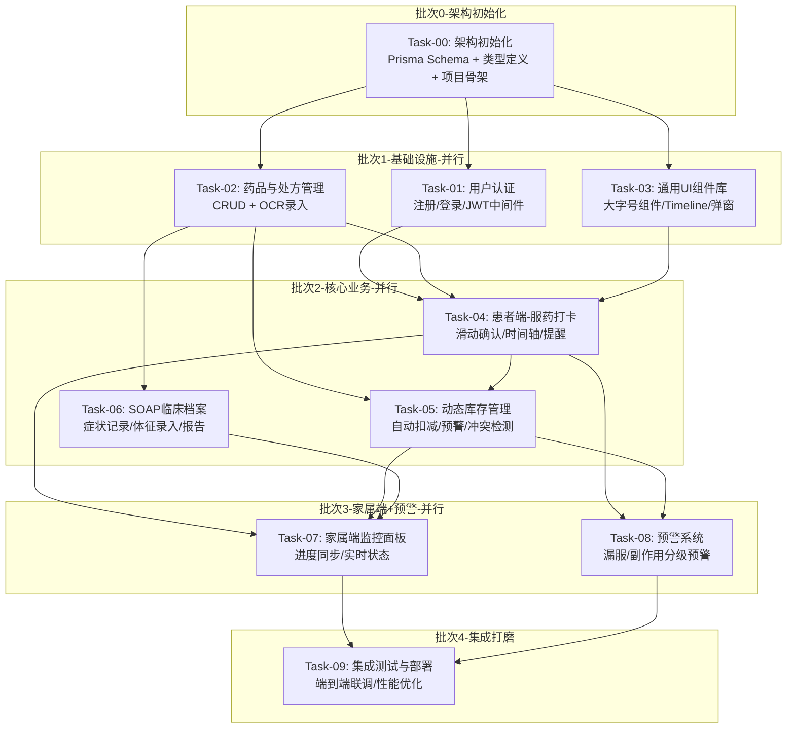

# 慢病用药小管家 — 任务拆解文档

## 一、项目架构概览

### 技术栈

| 层级 | 技术选型 |
|------|----------|
| 框架 | Next.js 14 (App Router) |
| 语言 | TypeScript (strict mode) |
| 样式 | TailwindCSS |
| ORM | Prisma |
| 数据库 | PostgreSQL |
| 认证 | NextAuth.js (Credentials + JWT) |
| 大模型 | DeepSeek / Kimi Vision API（OCR 处方识别） |
| 部署 | Vercel / Docker |

### 模块依赖关系图



---

## 二、接口契约清单

### 2.1 Prisma 数据模型 (schema.prisma)

> 以下为所有模块共享的核心数据模型，任何 Agent 不得修改此 Schema，如需扩展只能在各自模块内通过 API 层实现。

```prisma
// ─── 枚举 ───

enum Role {
  PATIENT    // 患者
  FAMILY     // 家属
}

enum Gender {
  MALE
  FEMALE
  OTHER
}

enum Severity {
  MILD       // 轻微
  MODERATE   // 中度
  SEVERE     // 重度
}

enum AlertLevel {
  YELLOW     // 黄色预警：库存不足
  ORANGE     // 橙色预警：漏服超过1小时
  RED        // 红色预警：严重副作用
}

enum AlertStatus {
  UNREAD
  READ
  RESOLVED
}

// ─── 用户模型 ───

model User {
  id            String    @id @default(cuid())
  phone         String    @unique
  passwordHash  String
  name          String
  role          Role
  gender        Gender?
  birthDate     DateTime?
  avatarUrl     String?
  createdAt     DateTime  @default(now())
  updatedAt     DateTime  @updatedAt

  // 关系
  bindingsAsPatient   FamilyBinding[]  @relation("Patient")
  bindingsAsFamily    FamilyBinding[]  @relation("Family")
  medicines           Medicine[]
  checkIns            CheckIn[]
  soapRecords         SOAPRecord[]
  alertSubscriptions  AlertSubscription[]
  deviceTokens        DeviceToken[]
}

// ─── 家属绑定 ───

model FamilyBinding {
  id          String    @id @default(cuid())
  patientId   String
  familyId    String
  verified    Boolean   @default(false)
  createdAt   DateTime  @default(now())

  patient     User      @relation("Patient", fields: [patientId], references: [id])
  family      User      @relation("Family", fields: [familyId], references: [id])

  @@unique([patientId, familyId])
}

// ─── 药品 ───

model Medicine {
  id          String    @id @default(cuid())
  userId      String
  name        String
  dosage      String       // e.g. "500mg"
  frequency   String       // e.g. "一日3次" → JSON: ["08:00","12:00","18:00"]
  scheduleJson String     // 服药时间点 JSON 数组
  note        String?
  createdAt   DateTime  @default(now())
  updatedAt   DateTime  @updatedAt

  user        User      @relation(fields: [userId], references: [id])
  inventory   MedicineInventory?
  prescriptions MedicinePrescription[]
}

// ─── 药品库存 ───

model MedicineInventory {
  id          String    @id @default(cuid())
  medicineId  String    @unique
  totalCount  Int          // 总片数/总剂量
  remainingCount Int       // 剩余数量
  unit        String       // "片" / "mg" / "ml"
  alertThreshold Int    @default(5)   // 低于此数量预警
  updatedAt   DateTime  @updatedAt

  medicine    Medicine  @relation(fields: [medicineId], references: [id])
}

// ─── 处方（OCR 识别记录） ───

model MedicinePrescription {
  id          String    @id @default(cuid())
  medicineId  String
  imageUrl    String?      // 原始处方/药盒照片
  ocrRawText  String?      // OCR 原始识别文本
  ocrResultJson String?    // AI解析后的结构化 JSON
  doctorName  String?
  hospitalName String?
  prescribedAt DateTime?
  createdAt   DateTime  @default(now())

  medicine    Medicine  @relation(fields: [medicineId], references: [id])
}

// ─── 服药打卡 ───

model CheckIn {
  id          String    @id @default(cuid())
  userId      String
  medicineId  String
  scheduledTime DateTime    // 计划服药时间
  actualTime    DateTime?   // 实际打卡时间（滑动确认时间）
  missed        Boolean  @default(false)
  missedAlertSent Boolean @default(false)
  confirmType   String?     // "swipe" | "manual"
  createdAt   DateTime  @default(now())

  user        User      @relation(fields: [userId], references: [id])
  medicine    Medicine  @relation(fields: [medicineId], references: [id])
}

// ─── SOAP 临床档案 ───

model SOAPRecord {
  id          String    @id @default(cuid())
  userId      String
  // S - Subjective
  subjectiveNote    String?          // 主观描述
  symptomSeverity   Severity?
  symptomTags       String?          // JSON 数组，表情/症状标签 e.g. ["😵头晕","😫乏力"]
  // O - Objective
  bloodPressure    String?           // "120/80"
  bloodSugar       Float?
  heartRate        Int?
  weight           Float?
  temperature      Float?
  // A/P - Assessment & Plan
  assessmentNote   String?
  adherenceRate    Float?            // 依从率 0-100
  reportJson       String?           // 自动生成的医生报告 JSON
  recordedAt       DateTime  @default(now())
  createdAt        DateTime  @default(now())

  user        User      @relation(fields: [userId], references: [id])
}

// ─── 预警消息 ───

model Alert {
  id          String      @id @default(cuid())
  targetUserId  String
  sourceUserId  String
  level       AlertLevel
  title       String
  message     String
  status      AlertStatus  @default(UNREAD)
  relatedCheckInId  String?
  relatedMedicineId String?
  createdAt   DateTime    @default(now())
  readAt      DateTime?

  targetUser  User      @relation("AlertTarget", fields: [targetUserId], references: [id])
  sourceUser  User      @relation("AlertSource", fields: [sourceUserId], references: [id])
}

// ─── 预警订阅 ───

model AlertSubscription {
  id          String    @id @default(cuid())
  userId      String
  missAlertEnabled   Boolean  @default(true)
  inventoryAlertEnabled Boolean @default(true)
  sideEffectAlertEnabled Boolean @default(true)
  missThresholdMinutes  Int   @default(60)    // 漏服超过N分钟触发预警

  user        User      @relation(fields: [userId], references: [id])
}

// ─── 设备推送Token ───

model DeviceToken {
  id          String    @id @default(cuid())
  userId      String
  token       String
  platform    String       // "ios" | "android" | "web"
  createdAt   DateTime  @default(now())

  user        User      @relation(fields: [userId], references: [id])
}
```

### 2.2 共享 TypeScript 类型定义

> 文件位置：`src/types/index.ts`（由 Task-00 创建，所有人引用）

```typescript
// ─── 用户相关 ───
export interface UserProfile {
  id: string;
  phone: string;
  name: string;
  role: 'PATIENT' | 'FAMILY';
  gender?: 'MALE' | 'FEMALE' | 'OTHER';
  birthDate?: string;
  avatarUrl?: string;
}

export interface LoginRequest {
  phone: string;
  password: string;
}

export interface RegisterRequest {
  phone: string;
  password: string;
  name: string;
  role: 'PATIENT' | 'FAMILY';
}

export interface AuthResponse {
  token: string;
  user: UserProfile;
}

// ─── 药品相关 ───
export interface MedicineInfo {
  id: string;
  userId: string;
  name: string;
  dosage: string;
  frequency: string;
  scheduleJson: string;   // JSON string → string[]
  note?: string;
}

export interface MedicineCreateInput {
  name: string;
  dosage: string;
  frequency: string;
  schedule: string[];      // ["08:00","12:00","18:00"]
  note?: string;
}

export interface OcrResult {
  name: string;
  dosage: string;
  frequency: string;
  schedule: string[];
  rawText: string;
  confidence: number;
}

// ─── 库存相关 ───
export interface InventoryInfo {
  id: string;
  medicineId: string;
  medicineName: string;
  totalCount: number;
  remainingCount: number;
  unit: string;
  alertThreshold: number;
  isLow: boolean;          // remainingCount <= alertThreshold
}

// ─── 打卡相关 ───
export interface CheckInInfo {
  id: string;
  userId: string;
  medicineId: string;
  medicineName: string;
  dosage: string;
  scheduledTime: string;   // ISO datetime
  actualTime?: string;
  missed: boolean;
  confirmType?: 'swipe' | 'manual';
}

export interface TodaySchedule {
  date: string;
  items: CheckInInfo[];
}

// ─── SOAP相关 ───
export interface SOAPRecordInfo {
  id: string;
  userId: string;
  subjectiveNote?: string;
  symptomSeverity?: 'MILD' | 'MODERATE' | 'SEVERE';
  symptomTags?: string[];
  bloodPressure?: string;
  bloodSugar?: number;
  heartRate?: number;
  weight?: number;
  temperature?: number;
  assessmentNote?: string;
  adherenceRate?: number;
  reportJson?: string;
  recordedAt: string;
}

// ─── 预警相关 ───
export interface AlertInfo {
  id: string;
  targetUserId: string;
  sourceUserId: string;
  sourceUserName: string;
  level: 'YELLOW' | 'ORANGE' | 'RED';
  title: string;
  message: string;
  status: 'UNREAD' | 'READ' | 'RESOLVED';
  createdAt: string;
}

// ─── API 通用响应 ───
export interface ApiResponse<T = unknown> {
  success: boolean;
  data?: T;
  error?: string;
}

export interface PaginatedResponse<T> extends ApiResponse<T[]> {
  total: number;
  page: number;
  pageSize: number;
}
```

### 2.3 API 路由约定

> 所有 API 路由以 `/api/` 为前缀，遵循 RESTful 风格。

| 模块 | 方法 | 路由 | 说明 | 请求体/参数 |
|------|------|------|------|------------|
| 认证 | POST | `/api/auth/register` | 用户注册 | `RegisterRequest` |
| 认证 | POST | `/api/auth/login` | 用户登录 | `LoginRequest` |
| 认证 | GET | `/api/auth/me` | 获取当前用户 | Header: `Authorization: Bearer <token>` |
| 药品 | GET | `/api/medicines` | 获取用户药品列表 | query: `?userId=` |
| 药品 | POST | `/api/medicines` | 添加药品 | `MedicineCreateInput` |
| 药品 | PUT | `/api/medicines/[id]` | 更新药品 | partial `MedicineCreateInput` |
| 药品 | DELETE | `/api/medicines/[id]` | 删除药品 | - |
| 药品 | POST | `/api/medicines/ocr` | OCR 识别处方 | FormData: `{ image: File }` |
| 库存 | GET | `/api/inventory` | 获取库存列表 | query: `?userId=` |
| 库存 | POST | `/api/inventory` | 初始化/更新库存 | `{ medicineId, totalCount, unit, alertThreshold }` |
| 打卡 | GET | `/api/checkins/today` | 今日打卡列表 | query: `?userId=` |
| 打卡 | POST | `/api/checkins` | 执行打卡 | `{ medicineId, scheduledTime, confirmType }` |
| 打卡 | GET | `/api/checkins/history` | 历史打卡记录 | query: `?userId=&startDate=&endDate=` |
| SOAP | GET | `/api/soap` | SOAP 记录列表 | query: `?userId=&page=&pageSize=` |
| SOAP | POST | `/api/soap` | 创建 SOAP 记录 | `SOAPRecordInfo` |
| SOAP | GET | `/api/soap/report` | 生成医生报告 | query: `?userId=&startDate=&endDate=` |
| 预警 | GET | `/api/alerts` | 预警消息列表 | query: `?targetUserId=&status=` |
| 预警 | PUT | `/api/alerts/[id]` | 标记已读/已处理 | `{ status }` |
| 家属 | GET | `/api/family/patients` | 家属绑定的患者列表 | query: `?familyId=` |
| 家属 | POST | `/api/family/bind` | 绑定患者 | `{ familyId, patientPhone }` |

### 2.4 中间件约定

- `src/middleware.ts` → Next.js Edge Middleware，负责 JWT 验证，白名单：`/api/auth/*`
- 受保护路由：除 `/login`、`/register` 外所有页面和 API

---

## 三、任务批次规划

### 批次 0（必须最先完成，串行）

| # | 任务名称 | 目标 | 输出产物 |
|---|---------|------|---------|
| 00 | 架构初始化 | 搭建 Next.js 项目骨架，定义 Prisma Schema，创建所有共享类型和接口 | `package.json`, `tsconfig.json`, `next.config.js`, `tailwind.config.ts`, `prisma/schema.prisma`, `src/types/index.ts`, `src/middleware.ts`, `src/lib/prisma.ts`, `.env.example` |

### 批次 1（并行执行，依赖批次0）

| # | 任务名称 | 目标 | 依赖 |
|---|---------|------|------|
| 01 | 用户认证系统 | 注册/登录 API，JWT 生成与验证，家属绑定 API | Task-00 |
| 02 | 药品与处方管理 + OCR | 药品 CRUD API，处方照片上传与 Vision API OCR 解析 | Task-00 |
| 03 | 通用 UI 组件库 | 大字号按钮、垂直时间轴、滑动确认弹窗、表情选择器、预警标签等 | Task-00 |

### 批次 2（并行执行，依赖批次1）

| # | 任务名称 | 目标 | 依赖 |
|---|---------|------|------|
| 04 | 患者端 - 服药打卡页面 | 今日任务时间轴 + 滑动确认服药 + 打卡历史 | Task-01, Task-02, Task-03 |
| 05 | 动态库存管理 | 库存自动扣减、低库存预警、新旧药冲突检测、复诊提醒 | Task-02, Task-04 |
| 06 | SOAP 临床档案 | 症状表情录入、体征数据录入、依从性统计、自动报告生成 | Task-01, Task-03 |

### 批次 3（并行执行，依赖批次2）

| # | 任务名称 | 目标 | 依赖 |
|---|---------|------|------|
| 07 | 家属端监控面板 | 患者列表、服药进度实时查看、库存状态监控 | Task-01, Task-04, Task-05, Task-06 |
| 08 | 预警系统 | 漏服检测、副作用分级预警、库存不足预警、推送通知 | Task-04, Task-05, Task-06 |

### 批次 4（串行，依赖批次3）

| # | 任务名称 | 目标 | 依赖 |
|---|---------|------|------|
| 09 | 集成测试与部署准备 | 端到端联调、页面路由整合、响应式适配、Dockerfile | Task-01~08 |

---

## 四、每个任务的完整 Agent 行动指令

> 每个任务的详细指令已独立输出到 `task/` 文件夹下，文件名格式：`Task-XX-[任务名].md`
